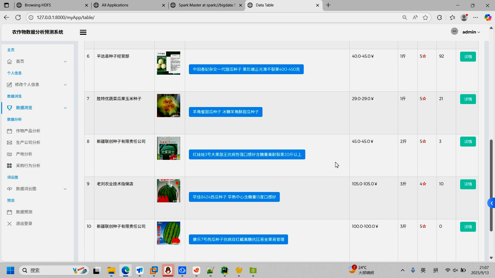
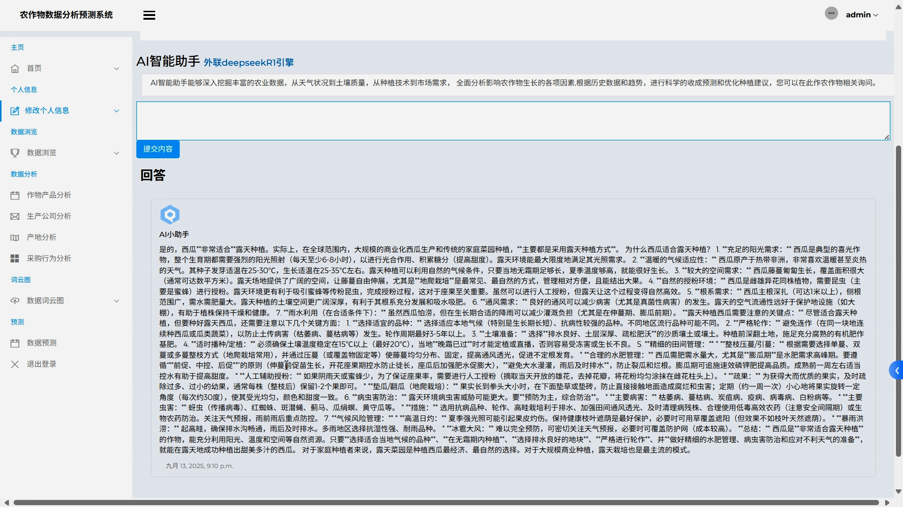

## 计算机毕业设计Spark+Hadoop+Hive+DeepSeek+Django农产品销量预测 农产品大模型AI问答 农产品数据分析可视化 大数据毕业设计

## 要求
### 源码有偿！一套(论文 PPT 源码+sql脚本+教程)

### 
### 加好友前帮忙start一下，并备注github有偿26大模型农产品
### 我的QQ号是1679232425 或者798059319或者2827724252 或者微信:biyesheji1698 或者 bysj2023nb

# 

### 加qq好友说明（被部分 网友整得心力交瘁）：
    1.加好友务必按照格式备注
    2.避免浪费各自的时间！
    3.当“客服”不容易，repo 主是体面人，不爆粗，性格好，文明人。
## 主要功能 
###  创新点：大模型、预测算法、可视化、爬虫、装逼虚拟机敲命令吊打导师看不懂
```
这个项目使用了一个以Hadoop为存储底座、Spark为计算核心、DeepSeek-R1为AI大脑、Web技术为展示窗口的综合性技术栈。其核心创新点在于将炙手可热的大语言模型（DeepSeek-R1）与传统大数据框架结合，并落地于具有重要社会意义的农业领域，构建了一个端到端的、具备先进预测和自然语言理解能力的智慧农业数据分析系统。 这是一个非常出色且紧跟技术潮流的毕业设计选题。觉得有帮助的同学可以一键三连哦

```


## 运行视频
https://www.bilibili.com/video/BV1RJHfzFEc3/

## 运行截图








